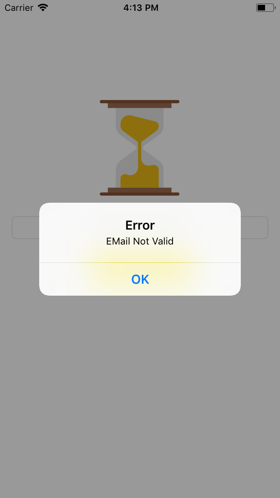
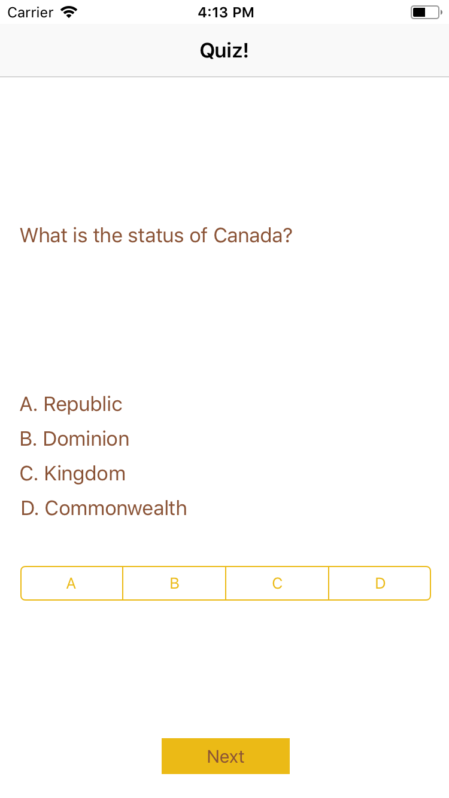
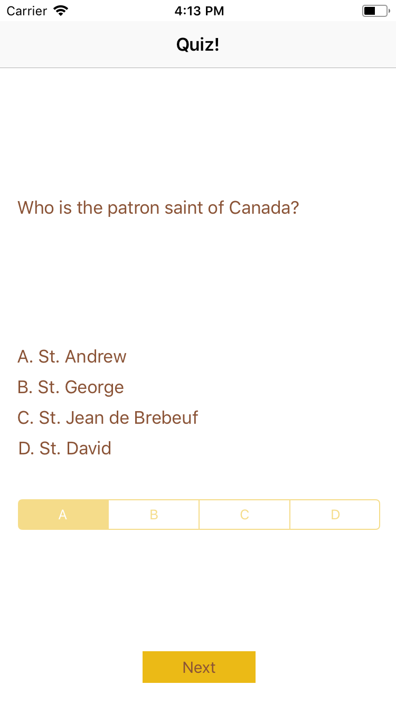
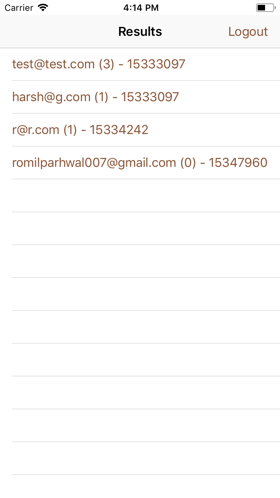

# Play
A multiplayer trivia app where friends compete to answer the most questions correctly.

Technologies Used 
1. Firebase by Google (Realtime online database implenmentation)
2. iOS (Swift)

Every imput is validated. In case of any invalid input, an error is shown. 

Login Screen

Email validation

Question screen

Answer screen

Results page

